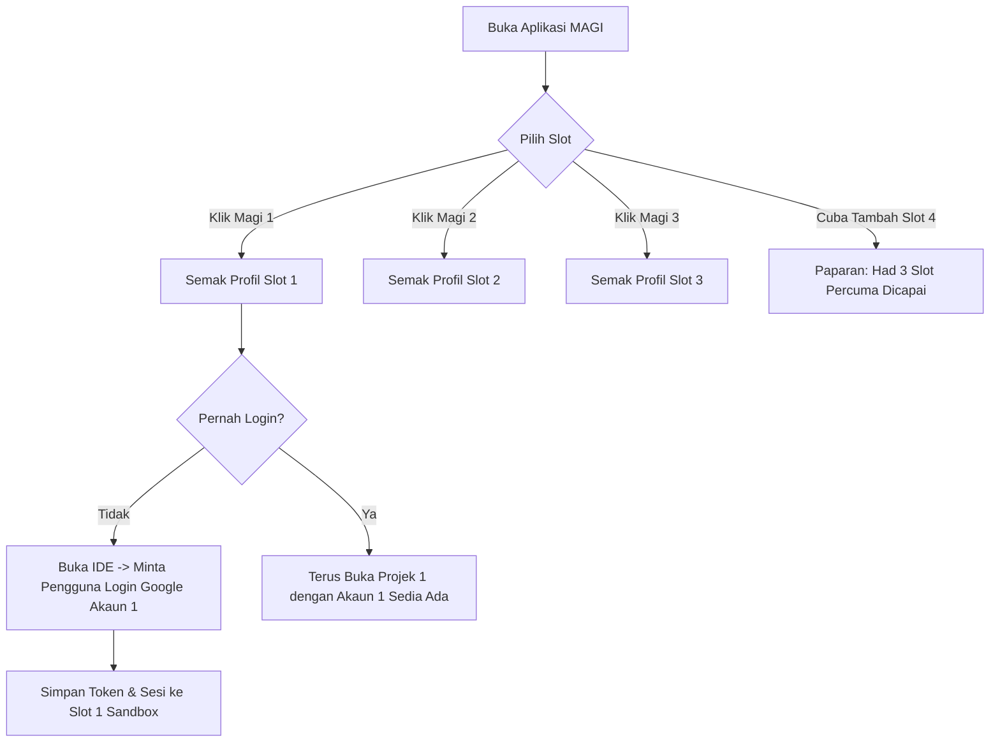

# MAGI (Multi AntiGravity IDE) 🚀
**Pengurus Multi-Akaun & Pelancar Multi-Profil Terpencil untuk AntiGravity IDE**

[](https://github.com/maui2023/magi)
[](LICENSE)
[]()
[-yellow.svg)]()
[]()

---

## 📌 Pengenalan & Latar Belakang

**MAGI** (*Multi AntiGravity IDE*) ialah aplikasi kawalan dan pelancar (launcher) khusus untuk pembangun yang menggunakan **Google AntiGravity IDE**. 

Secara lalai (*default*), AntiGravity IDE berkongsi satu direktori profil (`~/.config/Antigravity IDE`) dan storan memori ejen AI (`~/.gemini`). Ini menyebabkan:
1. Pembangun terpaksa *logout* dan *login* berulang kali jika memiliki lebih daripada satu akaun.
2. Sesi ejen pintar (Brain / Context Memory) bercampur-aduk antara projek yang berlainan.
3. Kredensial dan *tokens* akaun projek peribadi dan projek klien mudah bertindih (*credential collision*).

**Solusi MAGI:**
MAGI mengasingkan persekitaran (*environment sandbox*) bagi setiap akaun. Setiap akaun diperuntukkan **1 Projek khusus**. Apabila anda menekan slot **Magi 1**, sistem akan membuka sesi akaun pertama dan mengingatinya secara kekal (*persistent*). Begitu juga untuk **Magi 2** dan **Magi 3**.

> 🔒 **Had Versi Percuma (Free Edition):**
> Sistem ini dikunci (*hard-locked*) untuk **maksimum 3 Akaun / Slot** (`Magi 1`, `Magi 2`, `Magi 3`).

---

## ✨ Ciri-Ciri Utama (Core Features)

- 🗂️ **1 Akaun = 1 Projek (Strict Isolation)**
  Setiap slot mempunyai laluan projek (*workspace directory*) dan direktori profilnya sendiri.
- 💾 **Sesi Kekal & Auto-Remember (Session Persistence)**
  Hanya perlu log masuk sekali pada pelancaran pertama. Token sesi, kuki, dan keizinan disimpan dalam storan terasing profil tersebut.
- ⚡ **Antara Muka C++ GUI Super Pantas**
  Dibina dengan C++ natif untuk kelajuan maksimum, penggunaan memori RAM yang sangat minimum, dan tiada kebergantungan (*zero bloat*).
- 🔐 **Kunci Had 3 Akaun (Free Tier Enforcement)**
  Slot Magi 1, Magi 2, dan Magi 3 sedia digunakan. Slot tambahan dikunci secara automatik untuk edisi percuma.
- 🪟 **Sokongan Pelancaran Serentak (Side-by-Side Execution)**
  Anda boleh membuka Magi 1, Magi 2, dan Magi 3 serentak tanpa berlaku konflik proses fail *lock* VS Code/Antigravity.
- 🧠 **Pengasingan Memori Ejen AI (`~/.gemini`)**
  Ejen perbualan, artefak, dan sejarah perbincangan projek kekal selamat di dalam slot masing-masing.

---

## 🏗️ Seni Bina Pengasingan (Sandboxing Architecture)

Bagaimanakah MAGI mengasingkan setiap akaun tanpa menjejaskan pemasangan asal AntiGravity IDE?

MAGI memanfaatkan keupayaan teras Chromium/Electron dan VS Code CLI berserta isolasi pembolehubah persekitaran Linux:

```
~/.magi/
├── config.json                     <-- Konfigurasi slot, nama projek & laluan folder
└── slots/
    ├── slot_1/                     <-- Profil Penuh MAGI 1 (Akaun 1)
    │   ├── home/
    │   │   └── .gemini/            <-- Storan Ejen, Brain & Token Google Akaun 1
    │   ├── user-data/              <-- Kuki, Local Storage & Sesi VS Code Slot 1
    │   └── extensions/             <-- Plugin & Extension khusus Slot 1
    ├── slot_2/                     <-- Profil Penuh MAGI 2 (Akaun 2)
    │   ├── home/.gemini/
    │   ├── user-data/
    │   └── extensions/
    └── slot_3/                     <-- Profil Penuh MAGI 3 (Akaun 3)
        ├── home/.gemini/
        ├── user-data/
        └── extensions/
```

### Parameter Pelancaran Terpencil:
Apabila Magi 1 dimulakan, MAGI mengeksekusi proses di latar belakang dengan arahan:
```bash
HOME="$HOME/.magi/slots/slot_1/home" \
antigravity-ide \
  --user-data-dir "$HOME/.magi/slots/slot_1/user-data" \
  --extensions-dir "$HOME/.magi/slots/slot_1/extensions" \
  --new-window \
  "/path/to/project-1"
```

---

## 🖥️ Reka Bentuk Antara Muka GUI (C++)

Antara muka MAGI direka ringkas, moden, dan mesra pengguna dengan kad interaktif untuk 3 slot:

```
+---------------------------------------------------------------+
|  MAGI Launcher v1.0 [Free Tier: 3/3 Slots]                    |
+---------------------------------------------------------------+
|                                                               |
|  [ SLOT 1 ] Magi 1 (Active)                                   |
|  Projek : /home/user/github/projek-alpha                      |
|  Status : ✅ Akaun Tersimpan                                   |
|  [ 🚀 Launch Magi 1 ]  [ 📁 Tukar Projek ]  [ 🔄 Reset Sesi ] |
|                                                               |
|---------------------------------------------------------------|
|                                                               |
|  [ SLOT 2 ] Magi 2 (Ready)                                    |
|  Projek : /home/user/github/projek-beta                       |
|  Status : ⚠️ Perlu Login (Kali Pertama)                        |
|  [ 🚀 Launch Magi 2 ]  [ 📁 Set Projek ]    [ 🔄 Reset Sesi ] |
|                                                               |
|---------------------------------------------------------------|
|                                                               |
|  [ SLOT 3 ] Magi 3 (Kosong)                                   |
|  Projek : (Belum Ditetapkan)                                  |
|  Status : ⚪ Belum Dikonfigurasi                              |
|  [ 🚀 Launch Magi 3 ]  [ 📁 Set Projek ]    [ 🔄 Reset Sesi ] |
|                                                               |
|---------------------------------------------------------------|
|  🔒 [ + Tambah Akaun Baru ] (Terkunci - Versi Percuma Maks 3) |
+---------------------------------------------------------------+
```

---

## 🔄 Aliran Penggunaan (Workflow)



### Langkah demi Langkah:
1. **Langkah 1**: Jalankan pelancar MAGI (`./magi-gui` atau klik ikon aplikasi).
2. **Langkah 2**: Pada **Slot 1 (Magi 1)**, klik butang **Set Projek** dan pilih direktori kod projek pertama anda.
3. **Langkah 3**: Klik **Launch Magi 1**. 
   - Antigravity IDE akan dibuka.
   - IDE meminta anda log masuk. Sila log masuk ke **Google Account 1**.
   - Setelah log masuk, semua maklumat disimpan dalam sandbox Slot 1.
4. **Langkah 4**: Ulangi untuk **Slot 2 (Magi 2)** bagi akaun kedua & projek kedua, dan **Slot 3 (Magi 3)** bagi akaun ketiga.
5. **Langkah Seterusnya**: Untuk penggunaan harian, hanya klik **Launch Magi 1, 2, atau 3**. Sistem tidak lagi meminta log masuk dan terus melancarkan projek yang berkaitan secara berasingan!

---

## 🛠️ Keperluan Sistem & Pemasangan

### Keperluan Asas (Prerequisites)
- **Sistem Operasi**: Linux (Ubuntu 20.04/22.04/24.04, Debian, Arch Linux, Fedora, dll.)
- **AntiGravity IDE**: Sudah terpasang pada sistem (`antigravity-ide` atau `agy` boleh diakses melalui `$PATH`).
- **Compiler**: `g++` (C++17 atau terkini) & `make`.
- **Pustaka GUI**: GTK3 (`libgtk-3-dev`) atau Qt5/Qt6.

### Kompilasi & Pemasangan
```bash
# 1. Klon repositori ini
git clone https://github.com/maui2023/magi.git
cd magi

# 2. Pasang dependensi pembinaan (Ubuntu/Debian)
sudo apt update
sudo apt install -y build-essential libgtk-3-dev zenity

# 3. Kompilasi pelancar MAGI GUI C++
make

# 4. Jalankan aplikasi
./magi
```

---

## ⚙️ Format Konfigurasi (`config.json`)

Fail konfigurasi disimpan secara automatik di `~/.config/magi/config.json`:

```json
{
  "version": "1.0.0",
  "tier": "free",
  "max_slots": 3,
  "slots": [
    {
      "id": 1,
      "name": "Magi 1",
      "project_path": "/home/user/github/projek-alpha",
      "is_configured": true,
      "last_launched": "2026-09-30T21:30:00Z"
    },
    {
      "id": 2,
      "name": "Magi 2",
      "project_path": "/home/user/github/projek-beta",
      "is_configured": true,
      "last_launched": "2026-09-30T20:15:00Z"
    },
    {
      "id": 3,
      "name": "Magi 3",
      "project_path": "/home/user/github/projek-gamma",
      "is_configured": false,
      "last_launched": null
    }
  ]
}
```

---

## 🛡️ Keselamatan & Privasi

1. **Privasi Penuh Tempatan**: MAGI tidak menghantar apa-apa data akaun ke mana-mana pelayan pihak ketiga. Semua fail sesi kekal 100% pada cakera keras (*local storage*) komputer anda.
2. **Pembersihan Bersih (Clean Reset)**: Butang *Reset Sesi* membolehkan anda memadamkan semua kuki dan token bagi slot tertentu tanpa mengganggu slot lain.

---

## 🗺️ Pelan Hala Tuju (Roadmap)

- [x] Struktur spesifikasi & fail dokumentasi README.
- [ ] Prototaip skrip pelindung pelancar (*CLI wrapper*).
- [ ] Pembinaan GUI C++ (GTK3 / Native Window) dengan 3 slot interaktif.
- [ ] Pengurusan proses: Mengesan status PID (Menandakan sama ada sesi sedang aktif berjalan).
- [ ] Fail pemasangan desktop (`.desktop`) dan ikon menu aplikasi.
- [ ] Sokongan eksport/import tetapan profil projek.

---

## 📄 Lesen

Projek ini dilesenkan di bawah [Lesen MIT](LICENSE). Sesuai digunakan secara percuma untuk komuniti pembangun perisian.
